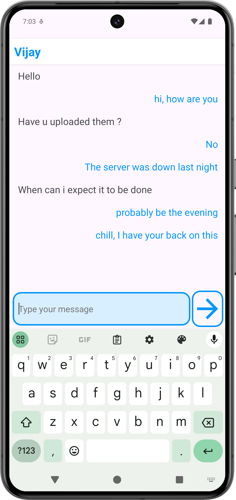
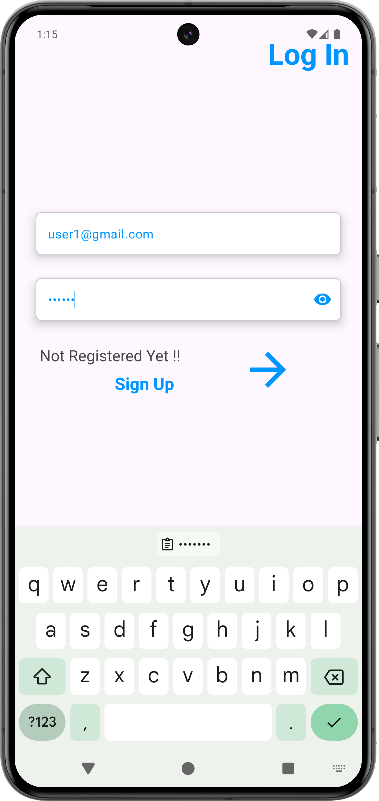
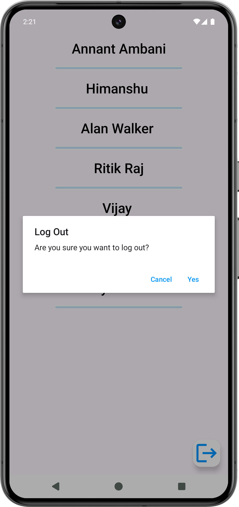
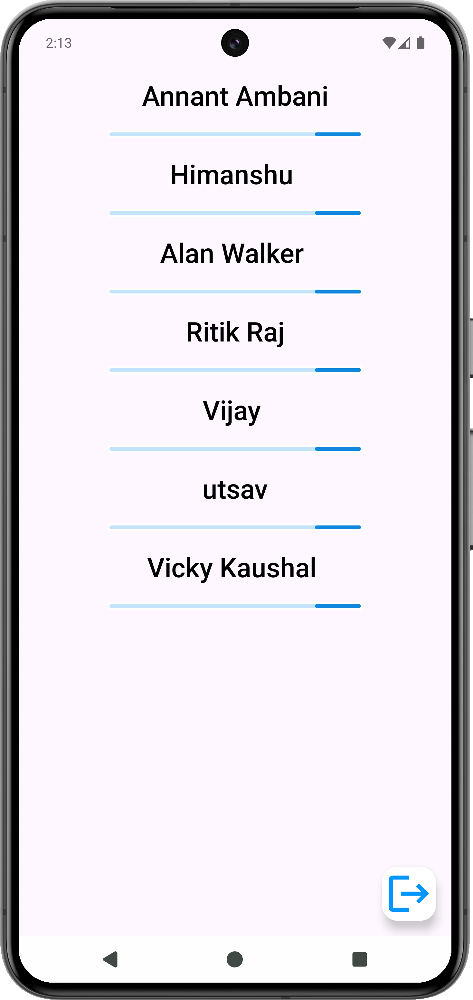
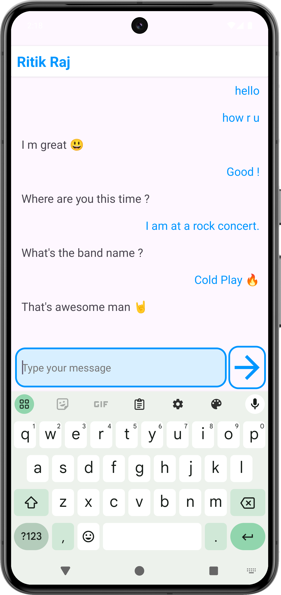

# Whisper Box - Real-Time Chat Application | [Website](https://ritikraaj77.github.io/WhisperBox/)

## Introduction

Whisper Box is a feature-rich, real-time 1-1 chat application designed for seamless communication and optimal performance. The app allows users to log in, initiate private conversations, and exchange messages in real-time.

## Key Features
- Private 1-1 chat allowing users to communicate in real-time
- Real-time messaging using Firebase Realtime Database for instant message delivery
- Secure user authentication with Firebase Authentication ensuring data privacy
- Message history stored and retrieved for seamless conversation continuity
- Smooth and immersive UI/UX with Material Design principles

## Media Gallery

<!-- 2x3 Grid with Video and Images -->
<table style="width:100%;">
  <tr>
    <!-- First row: video + 2 images -->
    <td style="padding: 10px;">
      
    </td>
    <td style="padding: 10px;">
      
    </td>
    <td style="padding: 10px;">
      
    </td>
  </tr>
  <tr>
    <!-- Second row: 3 images -->
    <td style="padding: 10px;">
      
    </td>
    <td style="padding: 10px;">
      
    </td>
    <td style="padding: 10px;">
      
    </td>
  </tr>
</table>

## Technical Details
- **Architecture**: MVVM (Model-View-ViewModel) for maintainable code
- **Authentication**: Firebase Authentication for secure login/sign-out
- **Database**: Firebase Realtime Database for storing chat messages
- **Chat Rooms**: Separate chat rooms per user, identified by sender and receiver IDs
- **RecyclerView**: Efficient display of chat messages with smooth scrolling

## Tools & Libraries
- **Languages**: Kotlin, Java
- **Database**: Firebase Realtime Database
- **Authentication**: Firebase Authentication
- **UI/UX**: Material Design, Android Jetpack Components
- **Navigation**: Intent Handling for navigating between screens

## Outcomes
- Successfully developed a scalable chat application using modern mobile frameworks
- Demonstrated expertise in real-time data handling and secure authentication
- Enhanced understanding of MVVM architecture and efficient data management

## Key Challenges & Solutions
- **Challenge**: Managing real-time chat synchronization across users
  - **Solution**: Used Firebase listeners to ensure instant message updates for both sender and receiver
- **Challenge**: Implementing a maintainable architecture for future scalability
  - **Solution**: Adopted MVVM pattern for organized and maintainable code structure

## Future Enhancements
- Integrating Agora SDK for audio/video calling features
- Implementing push notifications for background message alerts
- Introducing encryption for enhanced message privacy
